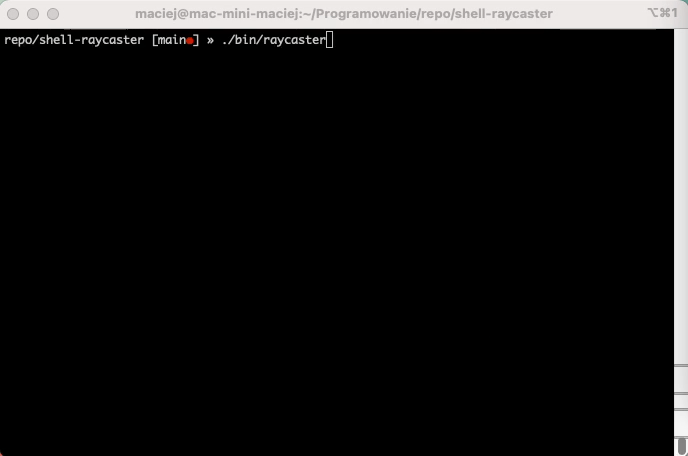
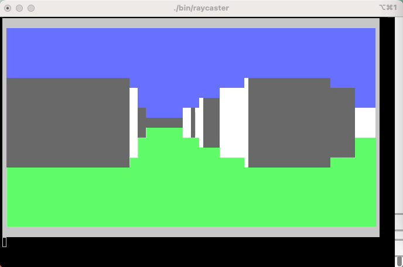

## Raycasting in the terminal
Generating pseudo 3D graphics in the shell

## Demo

  

## Building the project
Following programs must be installed:
* gcc
* make

Run `make all` in the cloned repository. Executable will be created in `bin/raycaster`

This program was tested and works on following operating systems:
* Linux
* macOS
* Windows (WSL + Windows Terminal)